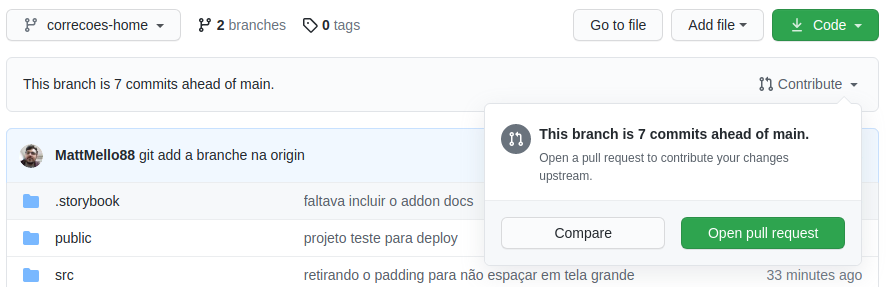
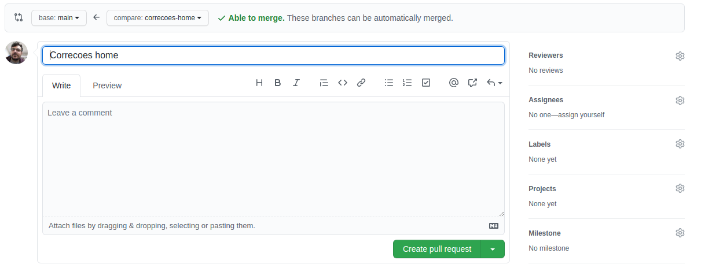

# Branche

## Criação de Brance

```sh
# git checkout -b nome-da-branche
```

Ao fazer o checkout de uma nova branche automaticamente o projeto já esta direcionando para esta branche.

> Nota: **# git status** vc pode verificar sua nova branche configurada

## Adicionar

Adicionar tudo de uma unica vez

```sh
# git add .
```

**ou**

Adicionar por arquivos selecionados

```sh
# git add -A -- /diretório/arquivo.text
```

## Commit

```sh
# git commit -m "msg"
```

### Nota

> Nota: Após realizar os commits na primeira vez que fizer o **# git push** para o repositório online deve-se criar esta brenche lá e trocar para receber nesta branche criada.

## Criando Branche Repositório online

Comando para mudar e criar a branche da sua origem

```sh
# git push --set-upstream origin correcoes-home
```


# Entendendo o Pull Request

Pull requesta só é possível fazer pelo repositório do Github na branche que estamos trabalhando para a branche master.



> Nota: Na imagem mostra a branche *correcoes-home* selecionada e na janelinha duas opções de *Compare* e *Open pull request*. Nesta mesma janalinha mostra o informativo que houve 7 commits a frante da principal branche.

## Iniciar o Pull Request - Requisição para subir

Ao clicar no **Open pull request** teremos a seguinte tela abaixo.



* No topo superior mostrar a direção do merge, onde os fontes vão sair da branche *correcoes-home* para branche *main* (default).
* do lado direito da tela mostra algumas opções como: Reviewers, uma pessoa especifica do projeto liderada para revisar todo o código fonte. Assignees, são cessionários, ou pessoas envolvidas no problema, ou testers que podem adiquirir esta pull request e atribuir a devida solução.
* A parte central irá informar um titulo e/ou deixar um comentário, este comentário tem formato de Markedown igual ao ``README.md``.

> Nota: Ao criar o **Pull Request** os deployers já vão disponibilizar um ambiente online ou para testar ou para uma prévia para seu cliente analisar.

### Deploye

O depolye irá recompilar seu projeto, refazer os test criado, e se o deployers que estiver usando precise que também faça em seu site para uma revisão. Tudo isso vai fazer parte do check list. Enquanto os check list não estiver aprovador o merge não se habilitá para submeter na sua brenche principal.

> Deployer Chromatic do storybook obriga revisar component por component criado para ser aprovado.


## Reviews

Após o Pull Request ser criado seu código fonte passar por um processo de analise. Alguém ou vocês mesmo pode revisar seu código podendo adicionar comentários, aprovar ou negar o seu pull request.


## O Merge

O Pull Request esta aprovado e os check list também. Uiiiii! \
Seu código fonte esta pronto para ser submetido para o projeto principal.